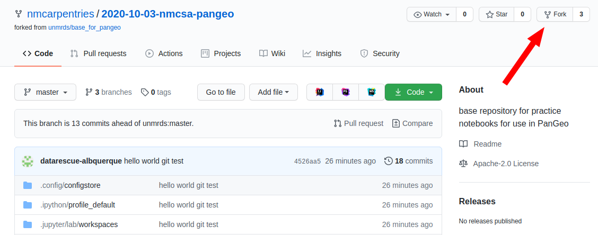
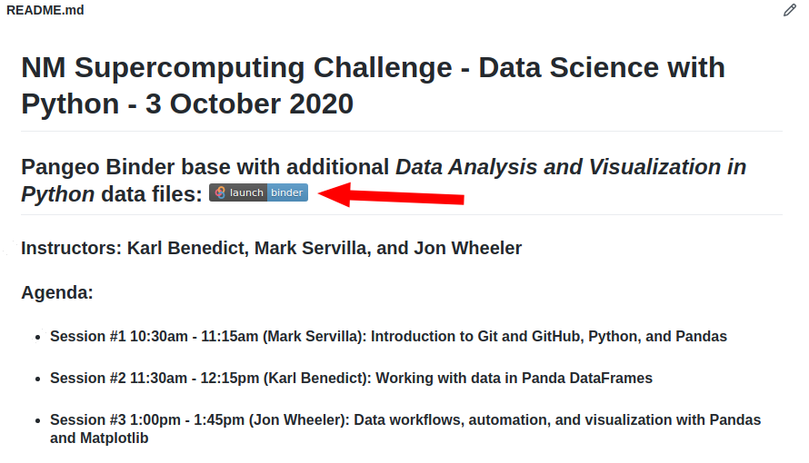

<h1 align="center">NM Supercomputing Challenge</h1>
<h1 align="center">Track D - Data Science with Python</h1>
<h2 align="center">3 October 2020</h2>

### Overview

#### The sessions in this workshop are based (albeit condensed due to time restrictions) on lessons in the Data Carpentry module, *Data Analysis and Visualization in Python for Ecologists*. The lessons are available at http://www.datacarpentry.org/python-ecology-lesson/, and are licensed with a Creative Commons Attribution (CC-BY-4.0) license: https://creativecommons.org/licenses/by/4.0/. The recommended citation is given here, though may be out of date:
> John Gosset, April Wright (eds): "Data Carpentry Python Ecology lesson." Version 2017.04.0, April 2017, http://www.datacarpentry.org/python-ecology-lesson/

#### Data Carpentry Code of Conduct
 - Use welcoming and inclusive language
 - Be respectful of different viewpoints and experiences
 - Gracefully accept constructive criticism
 - Focus on what is best for the community
 - Show courtesy and respect towards other community members
 
[Report a Code of Conduct violation](https://goo.gl/forms/KoUfO53Za3apOuOK2)

### Pangeo Binder base with additional *Data Analysis and Visualization in Python* data files: 

### Instructors: Karl Benedict, Mark Servilla, and Jon Wheeler

### General information: https://nmcarpentries.github.io/2020-10-03-nmcsa-online/

### Agenda
 - #### Session #1 10:30am - 11:15am (Mark Servilla): Introduction to Git and GitHub, Jupyter Notebooks, Python, and pandas
 - #### Session #2 11:30am - 12:15pm (Karl Benedict): Working with data in pandas DataFrames
 - #### Session #3 1:00pm - 1:45pm (Jon Wheeler): Data workflows, automation, and visualization with pandas and Matplotlib
 
### Quick Setup
 1. #### Create GitHub account and fork the [2020-10-03-nmcsa-pangeo](https://github.com/nmcarpentries/2020-10-03-nmcsa-pangeo) repository
 1. #### Launch the [Pangeo-Binder](https://binder.pangeo.io/v2/gh/nmcarpentries/2020-10-03-nmcsa-pangeo/master) cloud-based Jupyter Lab environment
 1. #### Customize the Pangeo-Binder environment GitHub account information in the Linux terminal
 1. #### Start the workshop Jupyter Notebooks (session1, session2, and session3) in the Pageo-Binder environment
 1. #### Save your Pageo-Binder environment to your forked GitHub repository

### Setup
 1. #### Web Browser - This entire workshop will be run through your web browser. All you need is a modern web browser like *Chrome*, *Firefox*, *Safari*, or *Edge* and a reasonably good Internet connection.
 1. #### GitHub - Before the workshop actually begins, you should create a [GitHub](https://github.com) account at https://github.com/join if you do not already have one. GitHub uses the Git version control system in a web-based environment that allows both individuals and teams to manage and collaborate on software code and other digital objects. We will be using GitHub as the source for an online [JupyterLab](https://jupyterlab.readthedocs.io/en/latest/) environment called [Binder](https://mybinder.org/), which is being hosted at [Pangeo.io](https://binder.pangeo.io/). All of the components for this project are in a specific GitHub repository at https://github.com/nmcarpentries/2020-10-03-nmcsa-pangeo. To make a copy of this GitHub repository in your own GitHub account space, you should use the "fork" button at the upper right of the GitHub web page (see below). This will allow you to make modifications to existing notebooks, add new notebooks or other documents to the project, and save all of the changes to your own GitHub repository.
 
 
 
 1. #### JupyterLab - [JupyterLab](https://jupyterlab.readthedocs.io/en/latest/) (a Jupyter Notebook on steroids) is a web browser-based environment that gives you the ability to interactively program in Python (and other interpreted languages like R and Julia), write documents and annotations in [Markdown](https://www.markdownguide.org/getting-started/), directly edit text files, and provides access to a command line terminal interface for manipulating local resources. We will be using primarily the Juptyer Notebook component of JupyterLab, and a little bit of the command line terminal to interact with GitHub. To launch an individual JupyterLab session with the **2020-10-03-nmcsa-pangeo** project, click on the "launch binder" button near the top of this README document (see below). The session that launches is unique to your web browser, but it is also tied to the "NM Carpentries" GitHub repository, which we cannot use to save any local modifications to the project. To save local modifications, we will change the default GitHub repository to the one you "forked" up above. We will show you how to do this in Session #1.
 
 
 
### References

 - Data Carpentry: https://datacarpentry.org/
 - Software Carpentry: https://software-carpentry.org/
 - Data Carpentry *Data Analysis and Visualization in Python for Ecologists*: https://datacarpentry.org/python-ecology-lesson/
 - Python: https://www.python.org/
 - pandas: https://pandas.pydata.org/pandas-docs/stable/index.html#
 - Matplotlib: https://matplotlib.org/3.3.1/index.html
